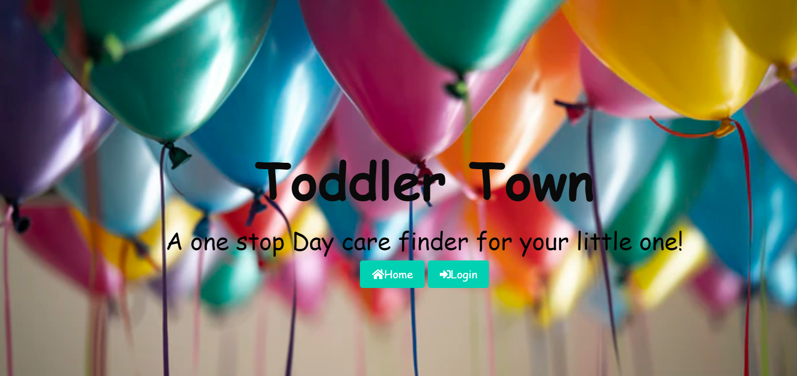
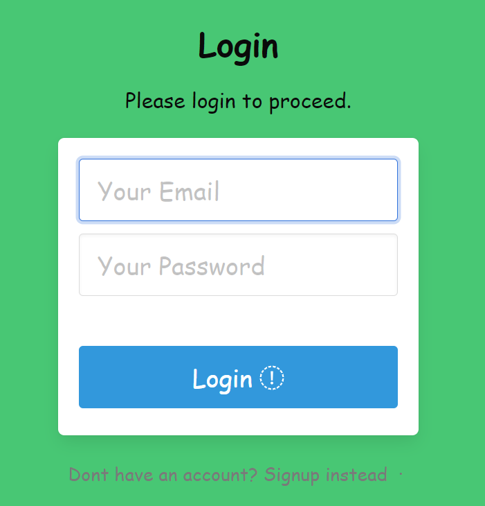
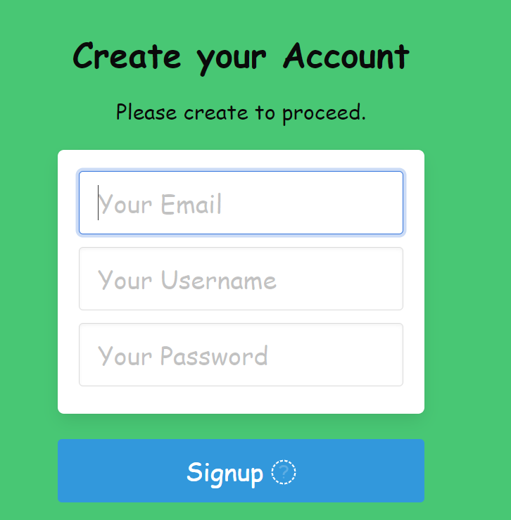

# Toddler Town 

## Table of Contents
* [Introduction](#introduction)
* [Design Process](#design)
* [Layouts and Frameworks used](#api)
* [App Presentation](#details)
* [What can the app do?](#details)
* [Deployment](#installations)
* [Credits](#credits)
 
 ## Introduction 
Working parents, especially a mother always finds it difficult to join back her work because they do not have much resources to send their young ones to a good day care.Picking an option from so many options available online and in person is always a big task.Especially for kids with special needs or who need extra attention, finalizing a good day care is of utmost importance.We’ve tried to address these problems by creating an app that allows a user to select a city where they reside/ or are planning to go and know about the 10 best and affordable day cares in their location.The user will be presented with the complete detail about a particular day care which will include its address, contacts and weblink to name a few.Not only this, but if the user wants to ask any question, in general, about a specific topic or wants to give in more information, they can go to our reviews section and share their information with others. 
## Design Process
   * Built a full stack app using the MVC paradigm, created our  server-side API, added user authentication, and connected the app to a database and deployed the app on a web  server.
   * Built on the agile development methodologies that we have  used throughout this course.
   * Instead of using the  HTML for the front end, used handlebars for displaying the front end version of the app.
   * All of this information is stored directly in our website for easy access.
   * We used a framework that was both easy-to use, but also responsive and optimize for the user’s experience.
   * We used Heroku web server to host our app and added a third party JAWS DB in order to display the seeded contents from the database.

 ## Layouts and Frameworks used
 1. __Libraries__ - In order to run the app, we installed alot of libraries, namely,
   * npm install sequelize
   * npm install dotenv
   * npm install mysql2
   * npm install express
   * npm install express-handlebars
   * npm install bcrypt
   * npm install express-session
 2. __Frameworks__ : We used the following frameworks to obtain font icons for our website and ready-to-use front-end components!
   * Font Awesome
   * Bulma
 3. __Database__: We used it in order to create our input and seed it into our web app
 
    * My SQL
 4. __Frontend, Backend and Styling__ : For this app, we skipped the html layout for our front end and used the normal styling techniches that has been used till now
   * Handlebars
   * CSS3
   * JavaScript

_Along with it,we deployed our app through __Heroku__ web host andConfigured an additional add on __JAWS DB__ in order to relate our code and database._

 
 ## App Presentation
 The web app created can be run either from the server using __localhost:3001__ or through the heroku link. Once uploaded, the web page looks something like this.
  __Loading page__
   
   
   __Login and Signup Page__
    
    
    
   __Login and Signup Page__
  
 

  ## What can the app do?
 Here's a chart off all the functions that our web app is required to do
 

 
 ## Deployment
  The app has been deployed on GITHUB, where all the codes are visible, and the working web app has been deployed on heroku
   * [The URL of the Github repo](https://github.com/Dipti2021/Toddler-Town)
   *  

    
   
   ## Credits
    The project has been assigned by the Carleton University Coding Bootcamp, our instructor and the TA's
   
     
 
 
 

